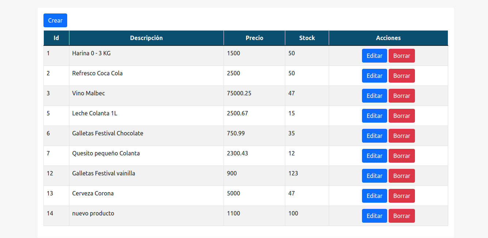
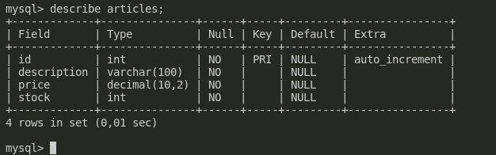
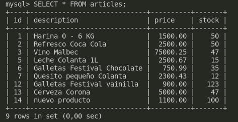

# API Rest Ful

Application that lists the products of a MySQL database through a rest ful API, Where a complete CRUD is carried out in which we can Create, Read, Update and Edit the data stored in a Mysql DB

## Front

HTML, Bootstrap, alertify js, fetch and JavaScript and a bit of CSS are used for the front-end.

## Back

For the backend node js is used with express, cors and mysql

___

## Instalation

To use it inside your pc locally you can clone this repository.

	git clone url

Then we enter the cd __name-dir__ folder and execute.

	npm install

This command will install all the necessary dependencies to run the project.

## Important

For it to work, you must have a DB in MYSQL with a table to be able to consume the data, for this example there is a file with the commands in the root of the project as an example of the database used that you can use as an example.

[File database](./database/db.sql)

### Table description

### Table content

Configure the database file with the user, password and db-name data that you create on your local machine, with its respective port, by default the application is made with port 3000.

[File Configuration keys BD](./src/keys.js)

With everything configured we execute from the root folder

	npm run start

For **KLICH84**